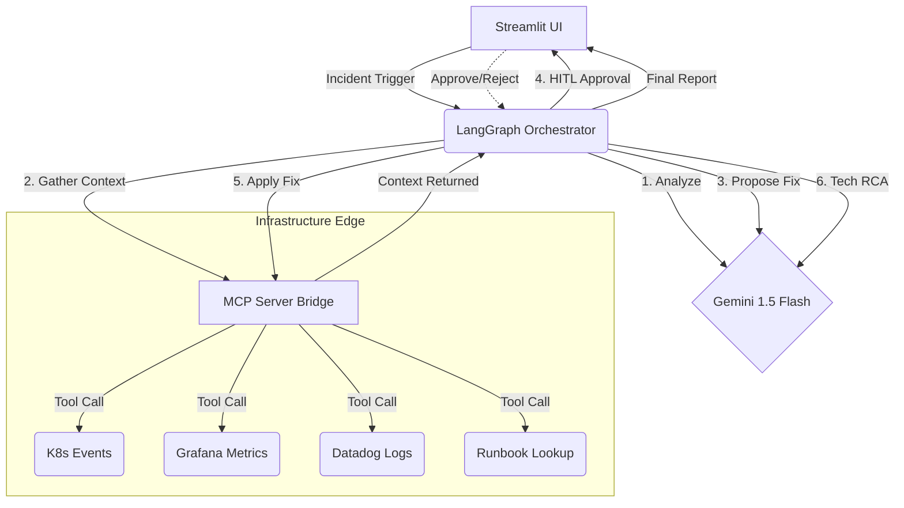

# 🛡️ SignalOps Universal SRE Agent

SignalOps is an autonomous Site Reliability Engineering (SRE) agent prototype designed to investigate, diagnose, and propose fixes for critical infrastructure incidents. 

Built with **LangGraph**, **Google Vertex AI (Gemini 1.5 Flash)**, and the **Model Context Protocol (MCP)**, SignalOps demonstrates how modern AI can assist in safe, automated DevOps workflows.

---

## 🌟 Architecture Highlights

SignalOps is a technical prototype designed to showcase agentic workflows for infrastructure management.

### 1. Universal Agent Orchestration
Using **LangGraph**, the agent's reasoning loop is decoupled from the specific infrastructure. This allows for flexible, multi-step diagnostic paths.



### 2. Model Context Protocol (MCP) Integration
SignalOps implements a simulated **MCP Server** (`mcp_server/server.py`). The agent discovers and uses diagnostic tools over the standard MCP protocol, demonstrating how AI agents can interact with external systems like Kubernetes or monitoring suites in a standardized way.

### 3. Safety-First AI Design
Executing changes on infrastructure requires strict controls. SignalOps implements multiple layers of safety:
*   **Human-In-The-Loop (HITL) Gate:** The agent pauses execution and requires explicit human approval before any remediation is applied.
*   **Context Compression:** The MCP server filters logs to keep only relevant error states, reducing noise and improving LLM accuracy.
*   **Structured Outputs:** Uses strict Pydantic schemas and `temperature=0.0` to ensure consistent and reliable responses.
*   **Input Validation:** Strict regex and type checks prevent prompt or command injection via untrusted data.

---

## 🛠️ Technology Stack
*   **Orchestration:** LangGraph
*   **Language Model:** Google Gemini 1.5 Flash (via Vertex AI)
*   **Tool Protocol:** Model Context Protocol (MCP)
*   **Frontend UI:** Streamlit

---

## 🚨 Included Simulation Scenarios

1.  **`payment-service` (OOMKill):** Diagnoses K8s container crashes due to memory limits.
2.  **`auth-service` (DB Timeout):** Detects connection pool exhaustion causing liveness probe failures.
3.  **`inventory-service` (Network Partition):** Identifies failing image pulls and upstream socket timeouts.
4.  **`api-gateway` (Prometheus Alert):** High 5xx error rates due to bad canary deployments.
5.  **`user-service` (K8s Bad Config):** CreateContainerConfigError due to missing secrets.

---

## 🚀 How to Run the Demo

### Prerequisites
SignalOps uses **Google Vertex AI**. You must have a GCP project and authenticated environment.

1.  **Authenticate:**
    ```bash
    gcloud auth application-default login
    ```
2.  **Set Environment Variables:**
    Create a `.env` file in the root directory:
    ```env
    GOOGLE_CLOUD_PROJECT="your-gcp-project-id"
    # Vertex AI uses ADC by default, no API key needed.
    ```

### Launch
```bash
# Install dependencies
pip install -r requirements.txt

# Launch the Streamlit Frontend
streamlit run ui/app.py
```
