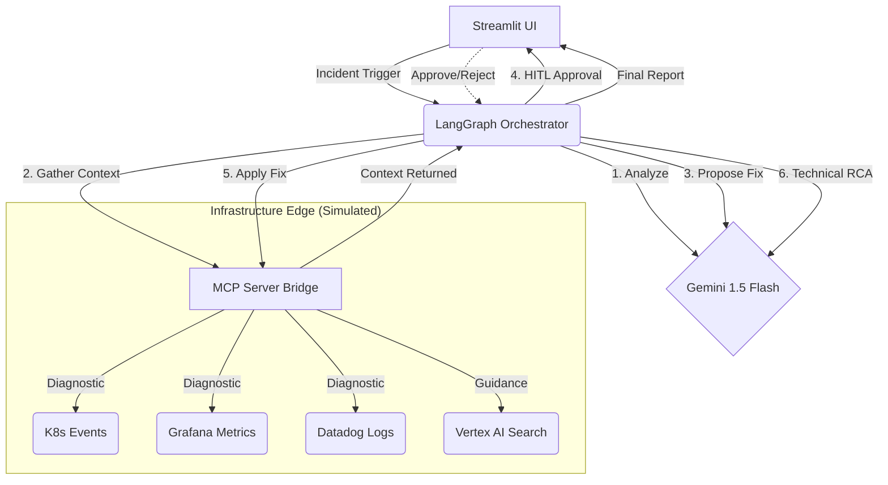

# 🛡️ SignalOps Universal SRE Agent

Built with **LangGraph**, **Google Gemini 3.5 Flash**, and the **Model Context Protocol (MCP)**, SignalOps demonstrates a safe, production-shaped approach to AI-driven DevOps.

## 📺 2-Minute Demo Video
A 2-minute demo video showing the agent in action is playable directly below:

<video src="output.mp4" width="100%" controls></video>

---

## 🏗️ Architecture: The Reasoning Engine

SignalOps operates on a **decoupled reasoning loop**. The "Brain" (Gemini) makes high-level decisions, while the "Hands" (MCP Tools) interact with the infrastructure.



### The SignalOps Lifecycle:
1.  **Analyze Alert:** When an alert is ingested (e.g., "Investigate payment-service crash"), the agent uses Gemini to identify the target service and dynamically select the most relevant diagnostic tools (Logs vs. Metrics vs. Events).
2.  **Gather Context (MCP):** The agent connects to an **MCP Server** to execute the selected tools. It implements **Context Compression**, filtering massive logs for `WARN/ERROR/FATAL` states to provide a clean, high-signal context to the LLM.
3.  **Propose Fix:** Gemini synthesizes the compressed evidence and a lookup from a **Runbook Knowledge Base** to propose a structured resolution.
4.  **HITL Gate (Safety):** A mandatory "Human-In-The-Loop" pause. No action is taken until a human operator reviews and clicks "Approve" in the UI.
5.  **Apply Fix:** The agent executes a simulated remediation step (e.g., "K8s Patch: Increase memory limit") through the MCP bridge.
6.  **Technical RCA:** A final technical Post-Mortem is generated, combining the original evidence with the confirmed result of the applied fix.

---

## 🛡️ Core Features & Guardrails

*   **Dynamic Tooling:** Unlike static scripts, the agent *decides* which tools to use based on the incident type.
*   **MCP Protocol:** Uses the open standard **Model Context Protocol** for tool discovery, making the agent "plug-and-play" for any infrastructure with an MCP server.
*   **Enterprise Safety:** Uses `temperature=0.0` and strict Pydantic schemas for deterministic responses, coupled with a mandatory HITL gate.
*   **Gemini API Integration:** Built using `gemini-3.5-flash` via Google AI Studio for fast, robust reasoning and native structured schema parsing.

---

## 🛠️ Technology Stack
*   **Orchestration:** LangGraph (Stateful, non-linear workflows)
*   **Language Model:** Google Gemini 3.5 Flash (via Google AI Studio)
*   **Tool Protocol:** Model Context Protocol (MCP)
*   **Frontend UI:** Streamlit (Interactive Dashboard)

---

## 🚀 Getting Started

### 1. Prerequisites
*   Gemini API Key from Google AI Studio.

### 2. Environment Setup
Create a `.env` file in the root directory:
```env
GOOGLE_API_KEY="your-gemini-api-key"
```

### 3. Installation
```bash
# We recommend using a virtual environment
python -m venv venv
source venv/bin/activate

# Install dependencies
pip install -r requirements.txt
```

### 4. Launch the Interactive Demo
```bash
streamlit run ui/app.py
```

---

## 🛡️ How to Test & Evaluate

SignalOps includes a comprehensive testing suite to verify agent reliability and accuracy.

### 1. Automated Evaluation Suite
To test the agent's reasoning across all 5 simulated scenarios (OOMKill, DB Timeout, Network Partition, etc.), run:
```bash
python scripts/run_evals.py
```
This script validates:
*   **Service Identification:** Does the agent pick the correct target service?
*   **Tool Selection:** Does it choose the appropriate diagnostic tools?
*   **RCA Faithfulness:** Does the technical analysis contain the expected root cause (e.g., "memory", "connection pool")?

### 2. Manual Verification
Select any "🚨" alert button in the Streamlit UI and observe:
1.  **Terminal Logs:** Watch the dynamic tool selection and MCP tool execution in real-time.
2.  **Side-by-Side Dashboard:** Review the "Raw Diagnostic Data" vs. "AI Root Cause Analysis" to see how the agent synthesizes messy logs into clear insights.
3.  **Post-Mortem:** Approve a fix and verify the final report includes the concrete remediation steps taken.

---

## 🔍 Why This Project Stands Out
*   **Interoperability:** By using MCP, we separate the "Reasoning Engine" from the "Infrastructure Edge."
*   **Production-Shaped:** While a prototype, the architecture mirrors real-world enterprise requirements for safety, auditability, and context management.
*   **Impact:** Solves the #1 problem in SRE—alert fatigue and slow MTTR—using a verifiable, agentic approach.

---

## ❓ FAQ & Troubleshooting

### Q1: I am seeing `429 RESOURCE_EXHAUSTED` rate-limit errors. How do I fix this?
*   **Cause:** Google AI Studio free tier keys have a rate limit of 15 Requests Per Minute (RPM) and a low daily request quota.
*   **Solution:** We have added a 6-second delay between cases in `run_evals.py` to prevent rate-limiting during testing. If you still encounter this, wait 60 seconds for the window to reset, or use a Pay-As-You-Go API key in your `.env` file to unlock up to 1,000 RPM.

### Q2: I get `ModuleNotFoundError` when running the scripts.
*   **Solution:** Ensure you have activated your virtual environment and installed the dependencies inside it:
    ```bash
    source venv/bin/activate
    pip install -r requirements.txt
    ```

### Q3: How do I transition this simulated prototype into a real-world environment?
*   **Solution:** That is the power of MCP! The reasoning engine in `agent/graph.py` is decoupled from the infrastructure tools. To point this to a real Kubernetes cluster or actual Datadog instance, you simply replace the `mcp_server/server.py` command configuration with the endpoint of a real production-grade MCP server. The core LangGraph agent requires zero code modifications.
